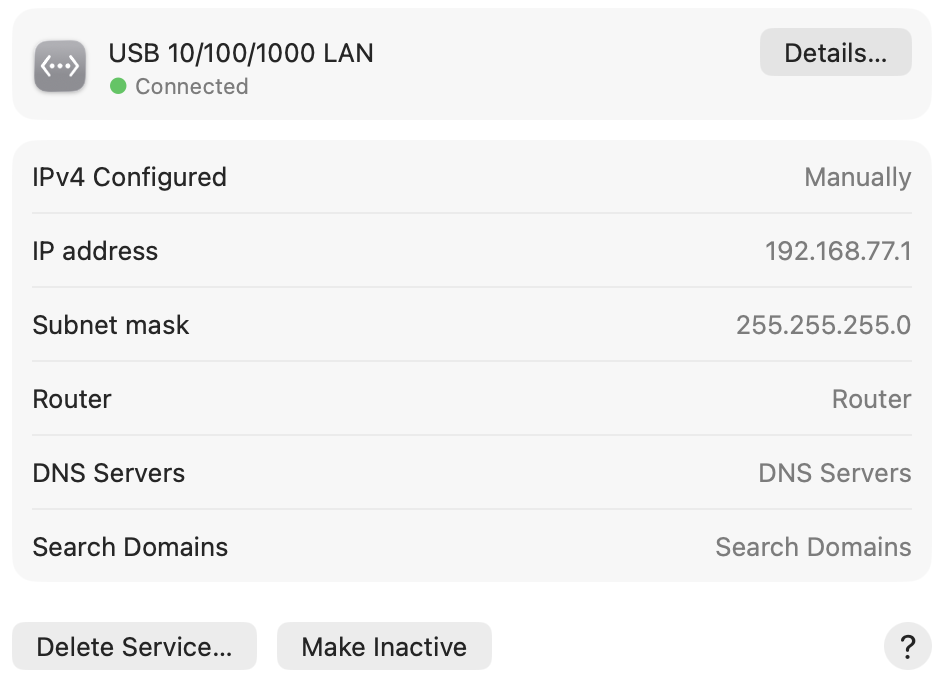

# SONiC ZTP Lab
This repository documents a Zero Touch Provisioning test for a SONiC switch using a MacBook. 

## Goal
1. Obtain an IP address through DHCP
2. Download a ZTP configuration file
3. Download a SONiC configuration
4. Install a firmware image

## Repository layout

```
ztp-lab/
├── dnsmasq-sonic-ztp.conf    # Configures DHCP and provides the SONiC ZTP URL
├── files/                    
│   └── ztp/
│       ├── ztp.json          # Defines the SONiC ZTP provisioning actions
│       ├── config_db.json    # Contains the SONiC switch configuration
│       └── scripts/
│           └── post_ztp.sh   # Runs additional commands after provisioning
└── captures/                 # Stores packet captures from ZTP testing
```

## Installation
We need dnsmasq for the DHCP server, and python for the HTTP server. 

```bash
brew install dnsmasq
```

## Configuration
1. Connect the Mac to the switches management port using ethernet.
2. Console into the switch.
On the Mac go to settings, and then network.
<p align="center">
  
</p>
Click on this and statically configure the IP address to 192.168.77.1, subnet mask to 255.255.255.0
<p align="center">
  
</p>

To check which port on the Mac is connected to the switch. 
```bash
networksetup -listallhardwareports
```
In this case, it is port 5. 
```
Hardware Port: USB 10/100/1000 LAN
Device: en5
Ethernet Address: 00:e0:4c:68:03:e0
```

## Testing 
We need 3 terminals: 
In the first terminal, we will start the HTTP server. 
```
ROOT=/Users/Shared/ztp-lab
SERVER_IP=192.168.77.1

python3 -m http.server 8000 \
  --bind "$SERVER_IP" \
  --directory "$ROOT"
```

In the second terminal, we will start the DHCP server. 
```
ROOT=/Users/Shared/ztp-lab
DNSMASQ="$(brew --prefix)/sbin/dnsmasq"

sudo "$DNSMASQ" \
  --no-daemon \
  --conf-file="$ROOT/dnsmasq-sonic-ztp.conf"
```

In the third terminal, we will start ZTP on switch's console. 
Check the version of the firmware. 
```
show version
```

Check the status of ZTP
```
show ztp status
```

If it is disabled, we need to enable it and then run ZTP. 
```
sudo ztp enable
sudo ztp run -y
```

## results
If the DHCP worked, then in the terminal you should get something like:
```
dnsmasq: started, version 2.93 DNS disabled
dnsmasq-dhcp: DHCP, IP range 192.168.77.100 -- 192.168.77.150, lease time 1h
dnsmasq-dhcp: user class: SONiC-ZTP
dnsmasq-dhcp: client provides name: sonic
dnsmasq-dhcp: DHCPDISCOVER(en5) 192.168.77.143
dnsmasq-dhcp: DHCPOFFER(en5) 192.168.77.143
dnsmasq-dhcp: DHCPREQUEST(en5) 192.168.77.143
dnsmasq-dhcp: DHCPACK(en5) 192.168.77.143 sonic
dnsmasq-dhcp: option 67 bootfile-name http://192.168.77.1:8000/ztp/ztp.json
```
This means the switch successfully get the ip address from the laptop, as well as the bootfile-name and knows where to find the json file. 

In the HTTP server terminal, you should get:
```
Serving HTTP on 192.168.77.1 port 8000 (http://192.168.77.1:8000/) ...
192.168.77.143 - - [30/Jul/2026 14:42:05] "GET /ztp/ztp.json HTTP/1.1" 200 -
192.168.77.143 - - [30/Jul/2026 14:42:07] "GET /ztp/scripts/post_ztp.sh HTTP/1.1" 200 -
192.168.77.143 - - [30/Jul/2026 14:42:21] "GET /ztp/firmware/Enterprise_SONiC_OS_4.5.1_Lite.bin HTTP/1.1" 200 -
192.168.77.143 - - [30/Jul/2026 14:47:54] "GET /ztp/config/config_db.json HTTP/1.1" 200 -
```
This means the switch was able to get the json, script, firmware, and the config_db. 


